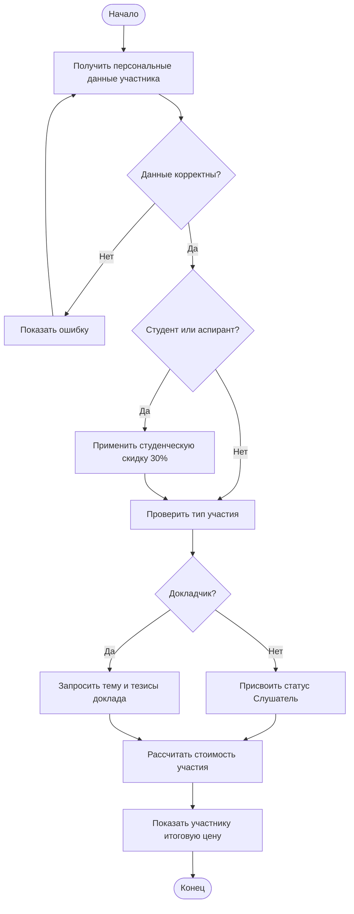

# Алгоритм проверки регистрации на конференцию

```mermaid
flowchart TD
    A([Начало]) --> B[Получить персональные данные участника]
    B --> C{Данные корректны?}
    C -- Нет --> D[Показать ошибку]
    D --> B
    C -- Да --> C2{Студент или аспирант?}
    C2 -- Да --> C3[Применить студенческую скидку 30%]
    C2 -- Нет --> E[Проверить тип участия]
    C3 --> E
    E --> F{Докладчик?}
    F -- Нет --> G[Присвоить статус Слушатель]
    F -- Да --> H[Запросить тему и тезисы доклада]
    G --> I[Рассчитать стоимость участия]
    H --> I
    I --> J[Показать участнику итоговую цену]
    J --> K([Конец])
```